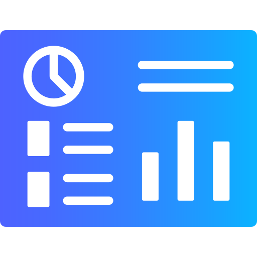
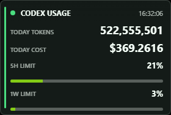
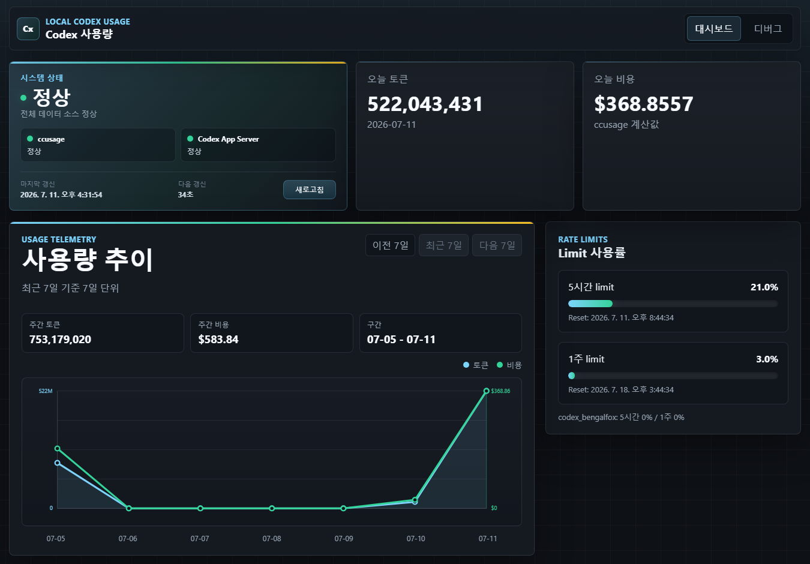
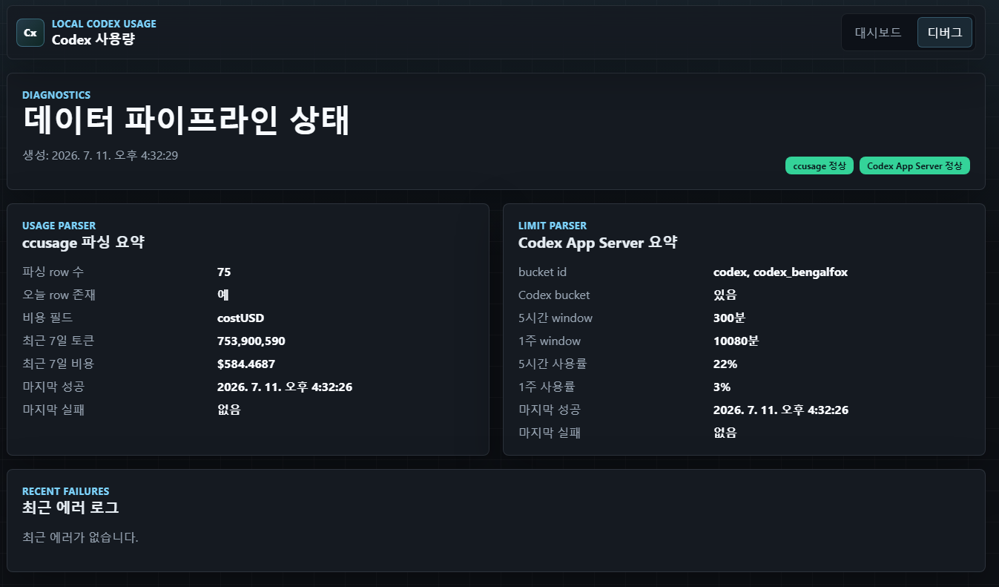
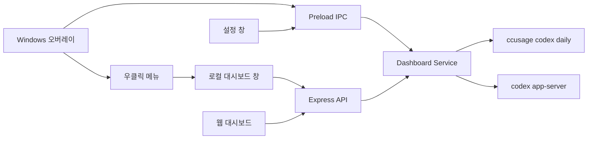

<div align="center">
  

  # MyCodex Usage Dashboard

  **Codex 사용량과 rate limit을 한눈에 확인하는 로컬 Windows 오버레이 · 대시보드**

  [](https://react.dev/)
  [](https://www.electronjs.org/)
  [](https://www.typescriptlang.org/)
  [](./LICENSE)
</div>

MyCodex Usage Dashboard는 로컬 Codex 사용량을 작은 데스크톱 오버레이와 전체 대시보드로 보여주는 애플리케이션입니다. `ccusage`의 토큰·비용 데이터와 `codex app-server`의 5시간·1주 rate limit을 하나의 화면에 모읍니다.

모든 데이터 수집은 로컬에서 이루어집니다. 오버레이를 항상 위에 띄워 핵심 수치를 빠르게 확인하고, 우클릭 메뉴에서 상세 대시보드와 설정 창을 열 수 있습니다.

## 화면

### Windows 오버레이 앱

<p align="center">
  
</p>

### 전체 사용량 대시보드

<p align="center">
  
</p>

### 디버그 화면

<p align="center">
  
</p>

## 주요 기능

- **상시 표시 오버레이** — 오늘 토큰, 오늘 비용, 5시간 limit, 1주 limit을 280 × 188 크기의 투명한 always-on-top 창에 표시합니다.
- **상세 대시보드** — 오늘의 핵심 지표, 7일 단위 토큰·비용 추이, 데이터 소스 상태와 limit 사용률을 제공합니다.
- **기간 탐색** — 최근 7일뿐 아니라 이전 주의 사용량 추이도 탐색할 수 있습니다.
- **독립적인 데이터 상태** — `ccusage`와 Codex App Server 중 한쪽이 실패해도 정상 데이터는 계속 표시합니다.
- **설정 저장** — 패널 불투명도, 자동 갱신 주기, 창 위치를 저장하고 다음 실행 시 복원합니다.
- **빠른 데스크톱 조작** — 오버레이를 드래그해 이동하고, 우클릭 메뉴에서 대시보드·설정·종료 기능을 사용할 수 있습니다.
- **디버그 화면** — 파싱 결과 요약, 데이터 소스별 마지막 성공·실패 시각, 정제된 최근 오류를 확인할 수 있습니다.
- **로컬 우선 보안** — Electron renderer의 Node.js 접근을 차단하고, preload IPC 계약과 navigation 제한을 적용합니다.

## 빠른 시작

### 사전 요구 사항

- Windows 환경 — 데스크톱 오버레이 실행 시 필요
- Node.js와 npm
- 설치 및 인증이 완료된 Codex CLI

### Windows 오버레이 실행

```bash
git clone https://github.com/KindTis/MyCodex.git
cd MyCodex
npm ci
npm run dev:overlay
```

오버레이는 실행 즉시 사용량을 조회합니다. 창을 우클릭하면 전체 대시보드, 설정, 종료 메뉴가 열립니다.

빌드된 앱을 패키징 없이 실행하려면 다음 명령을 사용합니다.

```bash
npm run build
npm run start:overlay
```

Windows portable 실행 파일은 다음 명령으로 생성합니다.

```bash
npm run package:overlay
```

결과물은 `release/` 디렉터리에 생성됩니다.

### 웹 대시보드 실행

개발 서버를 실행합니다.

```bash
npm ci
npm run dev
```

브라우저에서 `http://127.0.0.1:5173`을 엽니다. 프로덕션 빌드는 기본적으로 `http://127.0.0.1:4317`에서 제공됩니다.

```bash
npm run build
npm start
```

## 사용 방법

### 오버레이

- 창 전체를 드래그해 원하는 위치로 이동합니다.
- 우클릭 후 **대시 보드**를 선택하면 전체 대시보드가 열립니다.
- 우클릭 후 **설정**을 선택하면 패널 불투명도와 갱신 주기를 변경할 수 있습니다.
- 기본 갱신 주기는 30초이며, 5초에서 300초 사이로 설정할 수 있습니다.
- 패널 불투명도는 20%에서 100% 사이로 설정할 수 있습니다.

### 대시보드

- `/` — 오늘 토큰·비용, 7일 추이, 5시간·1주 limit, 데이터 소스 상태
- `/debug` — 파싱 요약, 마지막 성공·실패 시각, 최근 오류 로그

## 동작 구조



두 화면은 동일한 `DashboardResponse` 계약과 데이터 집계 서비스를 사용합니다. 웹 대시보드는 Express API를 거치고, 오버레이는 Electron preload IPC를 통해 같은 서비스를 직접 호출합니다.

## 기술 스택

| 영역 | 기술 |
| --- | --- |
| UI | React, TypeScript, CSS, SVG |
| 웹 개발·빌드 | Vite |
| 로컬 API | Node.js, Express |
| 데스크톱 | Electron, electron-builder |
| 사용량 데이터 | ccusage |
| Limit 데이터 | Codex App Server JSON-RPC |
| 테스트 | Vitest, Testing Library, jsdom |

## 프로젝트 구조

```text
MyCodex/
├─ electron/              # Electron main, preload, IPC, 창·설정·로그 관리
├─ server/                # Express API와 사용량 데이터 수집·정규화
│  ├─ data/               # ccusage, Codex App Server, dashboard service
│  └─ utils/              # 프로세스 실행과 민감 정보 정제
├─ shared/                # 웹과 Electron이 공유하는 타입·표시 모델·설정
├─ src/
│  ├─ components/         # 지표 카드, limit meter, 추이 차트
│  ├─ pages/              # 대시보드와 디버그 페이지
│  └─ windows/            # 오버레이와 설정 renderer
├─ scripts/               # preload 복사와 Windows 패키징 스크립트
└─ tests/fixtures/        # 데이터 파서 테스트 fixture
```

## npm 명령

| 명령 | 설명 |
| --- | --- |
| `npm run dev` | 웹 API와 Vite 개발 서버를 함께 실행 |
| `npm run dev:overlay` | Vite와 Electron 오버레이를 개발 모드로 실행 |
| `npm run build` | 서버, Electron, preload, renderer를 모두 빌드 |
| `npm start` | 빌드된 웹 대시보드 서버 실행 |
| `npm run start:overlay` | 빌드된 Electron 오버레이 실행 |
| `npm run package:overlay` | Windows portable 실행 파일 생성 |
| `npm test` | 전체 테스트 실행 |
| `npm run test:watch` | Vitest watch 모드 실행 |

## 데이터와 개인정보

- 대시보드 서버는 기본적으로 `127.0.0.1`에만 바인딩됩니다.
- 원본 사용량 JSON 전체를 브라우저나 디버그 화면에 노출하지 않습니다.
- 오류 메시지와 앱 로그는 토큰, 인증값, 사용자 경로 등 민감할 수 있는 내용을 정제합니다.
- Electron 설정과 로그는 운영체제가 제공하는 앱별 사용자 데이터 디렉터리에 저장됩니다.
- 실패 시 과거 값을 현재 값처럼 대체하지 않으므로, 화면은 항상 최신 조회 결과의 상태를 반영합니다.

## 테스트

```bash
npm test
```

테스트는 데이터 파싱·정규화, API, React 화면, Electron IPC와 preload 계약, 설정 저장, 창 수명주기, renderer 보안, 패키징 설정을 검증합니다.

## 라이선스

이 프로젝트는 [MIT License](./LICENSE)로 배포됩니다.
